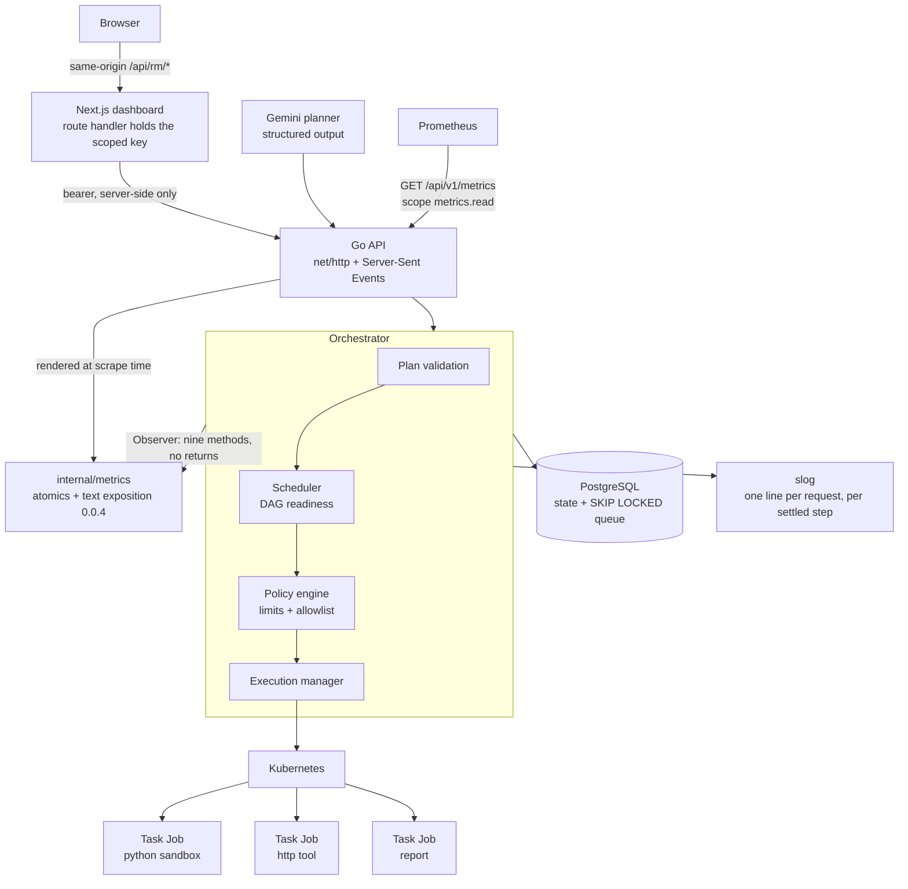
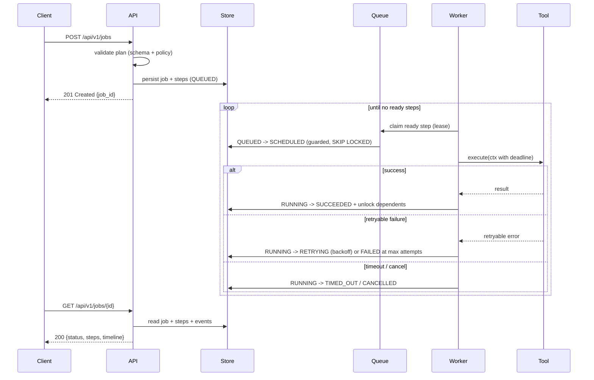
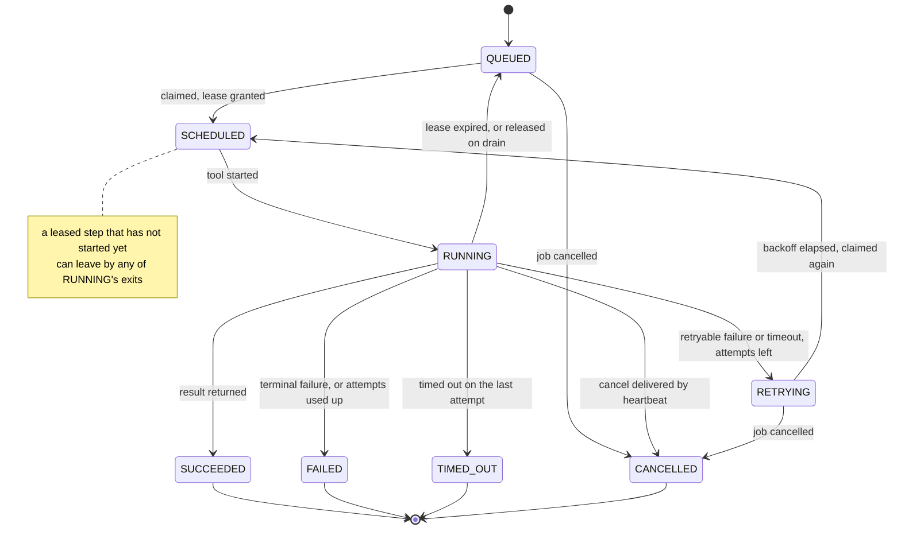
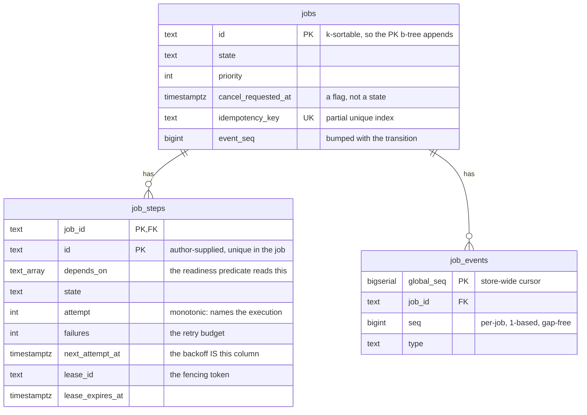
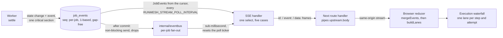

# RunMesh architecture

> An LLM decides **what** should be done. RunMesh decides **how** it is executed —
> safely, reliably, concurrently and observably.

## System view

The browser never addresses the Go API directly. It talks to the dashboard's own
route handler, which holds the scoped key in Node and forwards same-origin —
which is what a bearer credential and five response headers a cross-origin
browser cannot read make the cheaper trade than a seventh middleware in Go.

## Execution lifecycle

## Job state machine

The transition table itself is data in [`internal/runmesh/state.go`](../../internal/runmesh/state.go),
and a table test walks every pair against an independently written matrix.

## Where the interesting engineering is

| Concern | Mechanism | Introduced |
|---|---|---|
| Concurrency | Bounded worker pool, goroutines + channels + `select` | Week 1 |
| Cancellation | `context.Context` propagated API → scheduler → worker → tool | Week 1 |
| Timeouts | Per-step deadline derived from the tool contract | Week 1 |
| Dependencies | Step DAG; a step becomes ready when all `depends_on` succeed | Week 1 |
| Failure policy | Error taxonomy → retryable vs terminal; exponential backoff | Week 1 |
| Durability | PostgreSQL store; queue via `SELECT … FOR UPDATE SKIP LOCKED` | Week 2 |
| Crash recovery | Leases + heartbeats + a reconciler loop over expired leases | Week 2 |
| Authorisation | Scoped API keys, enforced from a route table a test walks | Week 2 |
| Isolation | Kubernetes Jobs: non-root, resource limits, NetworkPolicy | Week 3–4 |
| Planning | Gemini structured output → schema validation → policy validation | Week 5 |
| Metrics | A hand-rolled registry — atomics, closed-vocabulary labels, text exposition 0.0.4 — at `GET /api/v1/metrics` under its own `metrics.read` scope, fed by a nine-method `Observer` seam | Week 6 |
| Live updates | Server-Sent Events at `GET /api/v1/jobs/{id}/stream`; per-job `Event.Seq` is the SSE `id` and `Last-Event-ID` resumes on it; a durable poll leg keeps it correct across replicas | Week 6 |
| Dashboard | Next.js console: the execution waterfall reconstructed from the event stream rather than from step rows, over a same-origin route handler that holds the key | Week 6 |

## Persistence

Three tables, and the lock protocol that keeps them consistent.

**The `jobs` row is the lock.** Every mutating path takes it first and only then
touches step rows, so the two natural lock orders — `Claim` wanting steps then
job, `Finish` wanting job then step — cannot form a cycle. The sweeps take it
through `FOR UPDATE OF j SKIP LOCKED`; `Heartbeat` is the one write that takes
no job lock at all, because it is the hottest path in the system and cannot be
half of a cycle. See [ADR 0008](../decisions/0008-the-job-row-is-the-lock.md).

**Neither store implements the transition policy.** Both call
`internal/jobstate`, so the in-memory and PostgreSQL stores cannot disagree
about what a failure dooms or what a cancellation touches. `internal/storetest`
then covers what genuinely differs between them.

## Observability

One constraint shaped all of this: observability may never apply backpressure to
execution. It is not a slogan here, because the place it is violated is not the
exporter but the worker pool.

### Where a metric is recorded

| Site | Mechanism | What it carries |
|---|---|---|
| Engine goroutines | `engine.Observer` — nine methods, `internal/engine/observer.go` | claims, dispatcher wake-ups, dispatch hand-off, attempt and tool durations, settled outcomes, heartbeats, lease reclaims, sweeps |
| HTTP | `Logger`'s own deferred func, through `httpapi.HTTPObserver` | requests, status, response bytes, duration by matched route pattern |
| Store | a decorator in `cmd/server/store_metrics.go` | per-operation latency and error counts |
| Scrape time | `GaugeFunc` / `CounterFunc` in `internal/metrics/gauges.go` | workers, inflight, idle capacity tokens, queue depth, open streams, dropped events, the Go runtime |

The HTTP metric is emitted from the *same* deferred func that writes the request
log line, which already holds the status, the bytes, the elapsed time and the
low-cardinality route label. That is four lines and no new machinery, and it
makes it structurally impossible for the log line and the metric to disagree
about the same request. The store's latency arrives as a decorator rather than a
method on `engine.Store`, because that interface's own doc treats "no edit to
this file" as the proof the abstraction was designed.

### Why the Observer seam returns nothing, and why that matters where it is called

No method on `engine.Observer` returns anything. An observer therefore cannot
change an execution decision, cannot fail a step and cannot make a claim retry.
Observability that can alter behaviour is not observability; it is a second,
undocumented policy layer. The compiler enforces that half.

The other half is not enforceable by the type system, so it is written out in
the seam's own doc comment instead: **every method is called on an engine
goroutine.** `AttemptStarted`, `ToolExecuted`, `AttemptSettled` and `Heartbeat`
run on a worker that is holding one of the pool's capacity tokens; `Claimed`,
`Dispatched` and `DispatcherIdle` run on the single dispatcher; `SweepFinished`
and `LeaseReclaimed` run on the reconciler. So an implementation that takes a
lock, allocates per call, writes to an unsynchronised map or logs does not make
metrics slow — it **shrinks the worker pool**, and does so silently, arriving as
reduced throughput with no error anywhere. The shipped implementation is atomics
plus one map read under a read lock, and `TestObserveIsAllocationFree` asserts
the allocation half with `testing.AllocsPerRun` rather than leaving it as prose.

This seam is deliberately *not* the event stream. `runmesh.Event` is the
durable, ordered, replayable product surface described in the next section; the
Observer is a lossy in-process side channel for counters. Feeding metrics from
`Subscribe` instead would couple the exporter to a fan-out whose delivery drops
and to a ring that evicts, and a counter fed by a lossy channel is a counter
that lies, with a `rate()` that cannot be repaired after the fact.

### Why the metrics path is pulled, not aggregated

Every gauge in this runtime reports a number that already exists somewhere else,
so nothing is mirrored: workers, inflight and idle tokens are pulled from the
engine through a `metrics.Runtime` interface the metrics package declares itself;
open streams are pulled from the API's own admission counter — the one the 429 is
decided against; dropped events from the store's own counter. There is no
aggregation loop and no cached snapshot.

Two reasons, and the second is the harder constraint.

**Nothing can drift.** Two paths to one number agree until somebody adds an
early return on one of them. `ClaimErrors` and `LeasesExpired` are deliberately
*absent* from `metrics.Runtime` even though `engine.Stats()` has both, because
they are already counted with labels by `runmesh_claims_total{outcome="error"}`
and `runmesh_leases_expired_total`, and exporting them again as a derived gauge
is exactly that drift. `TestClaimErrorsMetricMatchesStats` and
`TestLeasesExpiredMetricMatchesStats` assert the counter and the snapshot still
agree after a real harness run.

**An aggregation loop would be a goroutine.** `internal/engine`'s package doc
fixes the goroutine census at exactly 2 + MaxWorkers, plus a third
adaptive-concurrency controller when `RUNMESH_MAX_WORKERS` actually widens the
pool above `RUNMESH_WORKERS`, plus one transient goroutine per in-flight step.
A deployment that never sets `RUNMESH_MAX_WORKERS` has MaxWorkers == Workers
and that third goroutine never starts at all — the census is textually the
same 2 + Workers it always was. A metrics goroutine anywhere in this process
contradicts that stated invariant, and no test counts goroutines, so nothing
would mechanically catch it. A `GaugeFunc` takes no context and owns no
goroutine: it is read on the scrape's own goroutine and nowhere else. The same
census is why `internal/eventbus` is its own package rather than a pump inside
the engine, and why `go_goroutines` is worth exporting at all — that gauge is
a live assertion of the invariant.

Cardinality is closed rather than trusted. `metrics.Label` is a name *plus its
permitted values*, and the vocabularies are taken at wiring time from the objects
that own them — tool names from `tools.Registry.Names()`, routes from
`httpapi.RoutePatterns()`, states from `runmesh.AllStates`, stop reasons from the
five `Stop` values. A value outside the set resolves to a shared `other` child
and increments `runmesh_metrics_label_rejected_total`, so a cardinality mistake
becomes a metric instead of an OOM, and the maximum number of series this binary
can export is a constant `TestSeriesBudget` asserts. The one genuinely open axis
is tool-supplied error codes, which is what `other` is for.

`GET /api/v1/metrics` sits in the same route table as every other endpoint,
under a scope of its own — a scrape token that could also list jobs would be
able to read every event body and every tool result, and this codebase has
already split `jobs.cancel` out of `jobs.write` on that reasoning. The handler
renders into a buffer before touching the `ResponseWriter`, because `Recover`
writes its JSON envelope unconditionally and Prometheus rejects a whole document
rather than a line: a spliced object would blank every panel at once. See
[ADR 0012](../decisions/0012-metrics-without-a-client-library.md) for why none
of this is `client_golang`.

## The live-update path, end to end

The two edges leaving `job_events` are the whole of
[ADR 0013](../decisions/0013-server-sent-events-not-websockets.md): the durable
poll leg is the correctness mechanism and the process-local bus is a latency
accelerator over it.

**The worker appends the event inside the same critical section as the state
change.** Not after it. `seq` is assigned under the job lock, next to the
transition that produced it, which is what makes it per-job, 1-based and
gap-free. There is no window in which a step is `SUCCEEDED` and the timeline
does not say so, and no ordering a reader has to reconcile afterwards.

**The store fans out after commit.** `publish` runs once the transaction has
committed, so a subscriber can never observe an event a rollback then un-wrote.
Delivery is a non-blocking send that drops when a subscriber is slow, and
memstore's per-job ring evicts for the same reason. The price is stated rather
than hidden: a crash between commit and publish loses the live notification,
never the timeline, and a client resumes from its cursor.

**The broker accelerates.** `internal/eventbus` turns one store subscription
into many per-job ones, indexed by job so that one event wakes only the
connections that asked for it instead of every open stream in the process. It is
its own package, constructed in `run()` like every other dependency, because a
fan-out goroutine inside `internal/engine` would contradict the goroutine census
above. `bus.Close()` sits inside `shutdown()` *after* `eng.Shutdown` — so no
event is produced with nobody to consume it — and *before* `store.Close()` — so
the pump is not left reading a channel the store closed underneath it. A `defer`
next to the store's gets that order exactly backwards.

**The SSE handler reconciles against the durable cursor.** Both stores'
`Subscribe` is process-local, so a handler served from the bus alone would show
each dashboard, on a two-replica deployment behind a load balancer, only the
events its own replica happened to write — a plausible, wrong waterfall, which
is worse than polling. So the handler runs one `select` over five cases — client
gone, draining, a live event, the heartbeat tick, the poll tick. The poll leg
reads `Store.JobEvents` from the cursor every `RUNMESH_STREAM_POLL_INTERVAL`; a
live event is emitted immediately and **resets that ticker**, so on the replica
that wrote the event latency is sub-millisecond and the poll never fires. Remove
the bus entirely and every event still arrives, one poll later.

A drop is repairable rather than visible. Because `seq` is gap-free, a live
event whose `Seq` exceeds `lastSeq+1` says exactly what was missed, and one
`JobEvents` read fills it before the frame is emitted — a dropped event becomes
a catch-up query, not a client-visible hole and not a disconnect. The one case
that cannot be repaired is the in-memory ring evicting history the client never
received; that gets an explicit `resync` frame, because rendering a timeline
with a silent hole in it is the failure worth a frame of its own. The resume
cursor itself was inherited, not designed: `id:` on every frame,
`Last-Event-ID` on reconnect and `?after=` on the polling endpoint are one
number.

**The route handler holds the credential.** `EventSource` cannot set request
headers, but `fetch` plus `response.body.getReader()` is a frame reader in about
thirty lines, so that limitation never binds. The dashboard's own route handler
holds the scoped key server-side and pipes `upstream.body` straight through: the
key never reaches a bundle, the browser talks same-origin, and no CORS
middleware was added outside `Auth`. The cost is named rather than glossed — that
proxy is a confused-deputy surface, and its session check is the only thing
between a signed-out visitor and a whole job timeline, in a file the Go test
suite cannot see.

**The browser folds events into lanes.** `mergeEvents` deduplicates on `seq`
first, because the three producers overlap on purpose — the stream's `snapshot`
frame is a catch-up page, a reconnect replays from the cursor, and a poll that
raced a frame fetches the same event twice — and a reducer handed the same
`STEP_SCHEDULED` twice opens the same attempt twice and draws phantom retries.
`buildLanes` then groups by step id and attempt and pairs `STEP_SCHEDULED` →
`STEP_STARTED` → one of `STEP_FINISHED`, `STEP_RETRY_SCHEDULED`,
`STEP_LEASE_EXPIRED` or `STEP_RELEASED`. The waterfall is reconstructed from the
events and not from the step rows, and that is not a preference: a step row only
ever describes the *current* attempt, because every claim resets `scheduled_at`,
nulls `started_at` and `ended_at` and increments `attempt`, while a release or a
lease expiry nulls them outright. The events remember all of it and nothing else
does. The snapshot is used only for structure — `depends_on`, `blocked_by`,
`max_attempts`, the step's order — and never for a bar edge.

One instrument crosses both halves of Week 6. `Logger`'s duration observation
fires when a handler *returns*, and a stream handler returns when somebody
closes a browser tab, so an hour-long dashboard would drop a 3,600,000 ms
observation into the same histogram as a 4 ms readiness probe and every latency
panel in the deployment would silently be describing tab lifetimes. The
streaming routes are therefore excluded from the request-duration histogram by
name, through `httpapi.StreamingRoutePatterns()`, and their count is exported as
`runmesh_http_streams_active` — pulled from the same admission counter the
stream cap is enforced against, so the gauge and the cap cannot disagree.

## Design records

Decisions with real alternatives are recorded in [`docs/decisions`](../decisions):

- [0001 — Execution is at-least-once](../decisions/0001-execution-is-at-least-once.md)
- [0002 — PostgreSQL is the queue; Redis is deferred](../decisions/0002-postgresql-is-the-queue.md)
- [0003 — Execute tasks as Kubernetes Jobs, not raw Pods](../decisions/0003-kubernetes-jobs-not-pods.md)
- [0004 — Standard-library `net/http`, zero third-party dependencies](../decisions/0004-standard-library-http.md)
- [0005 — The store owns every state transition](../decisions/0005-store-owns-transitions.md)
- [0006 — Readiness is a predicate, not a state](../decisions/0006-readiness-is-derived.md)
- [0007 — One dependency: the PostgreSQL driver](../decisions/0007-one-dependency-the-postgres-driver.md)
- [0008 — The job row is the lock](../decisions/0008-the-job-row-is-the-lock.md)
- [0009 — The sandbox is the pod, not the interpreter](../decisions/0009-the-sandbox-is-the-pod.md)
- [0010 — The plan asks; the operator grants](../decisions/0010-the-plan-asks-the-operator-grants.md)
- [0011 — The model chooses; the runtime decides](../decisions/0011-the-model-chooses-the-runtime-decides.md)
- [0012 — Metrics without a client library](../decisions/0012-metrics-without-a-client-library.md)
- [0013 — Server-Sent Events, not WebSockets](../decisions/0013-server-sent-events-not-websockets.md)
