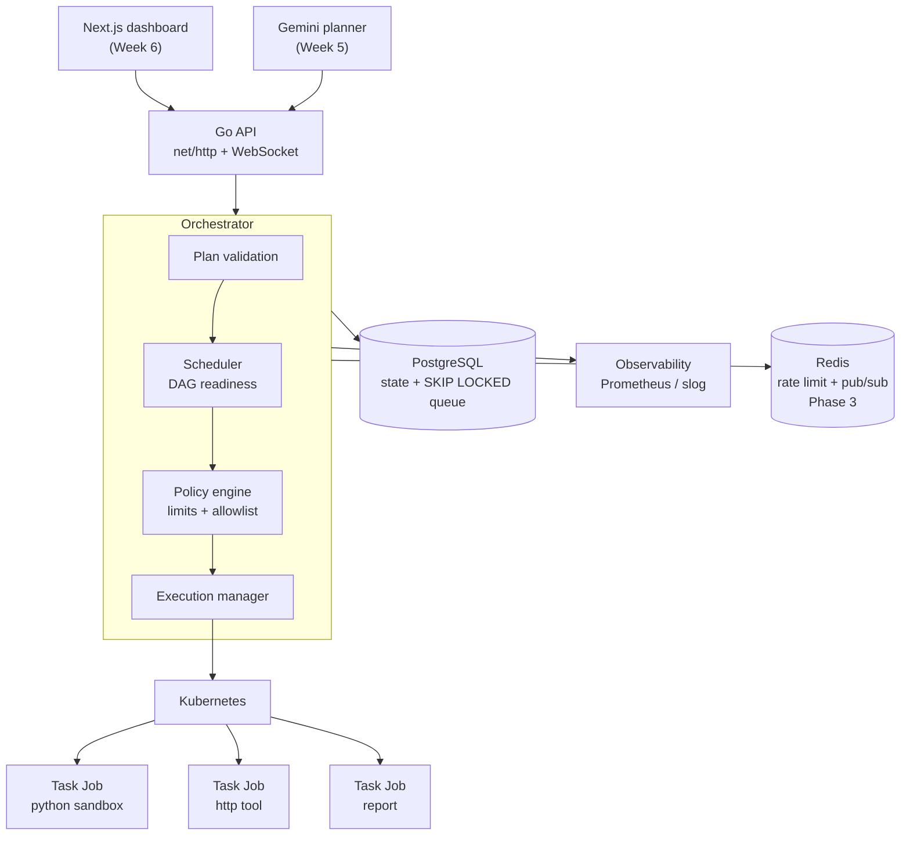
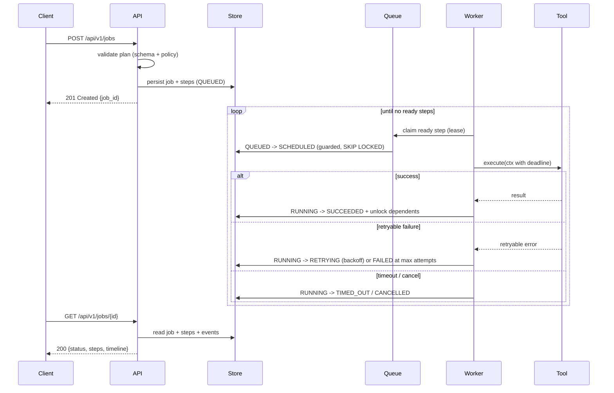
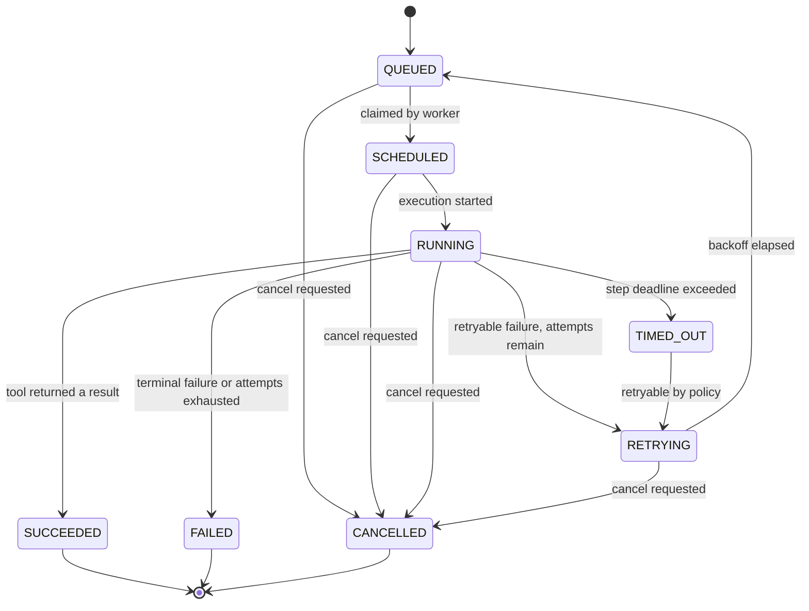
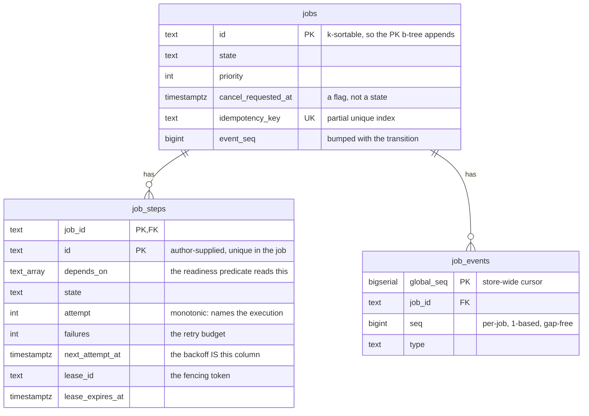

# RunMesh architecture

> An LLM decides **what** should be done. RunMesh decides **how** it is executed —
> safely, reliably, concurrently and observably.

## System view

## Execution lifecycle

## Job state machine

## Where the interesting engineering is

| Concern | Mechanism | Introduced |
|---|---|---|
| Concurrency | Bounded worker pool, goroutines + channels + `select` | Week 1 |
| Cancellation | `context.Context` propagated API → scheduler → worker → tool | Week 1 |
| Timeouts | Per-step deadline derived from the tool contract | Week 1 |
| Dependencies | Step DAG; a step becomes ready when all `depends_on` succeed | Week 1 |
| Failure policy | Error taxonomy → retryable vs terminal; exponential backoff | Week 1 |
| Durability | PostgreSQL store; queue via `SELECT … FOR UPDATE SKIP LOCKED` | Week 2 |
| Crash recovery | Leases + heartbeats + a reconciler loop over expired leases | Week 2 |
| Authorisation | Scoped API keys, enforced from a route table a test walks | Week 2 |
| Isolation | Kubernetes Jobs: non-root, resource limits, NetworkPolicy | Week 3–4 |
| Planning | Gemini structured output → schema validation → policy validation | Week 5 |
| Observability | Event timeline, Prometheus metrics, execution waterfall UI | Week 6 |

## Persistence

Three tables, and the lock protocol that keeps them consistent.

**The `jobs` row is the lock.** Every mutating path takes it first and only then
touches step rows, so the two natural lock orders — `Claim` wanting steps then
job, `Finish` wanting job then step — cannot form a cycle. The sweeps take it
through `FOR UPDATE OF j SKIP LOCKED`; `Heartbeat` is the one write that takes
no job lock at all, because it is the hottest path in the system and cannot be
half of a cycle. See [ADR 0008](../decisions/0008-the-job-row-is-the-lock.md).

**Neither store implements the transition policy.** Both call
`internal/jobstate`, so the in-memory and PostgreSQL stores cannot disagree
about what a failure dooms or what a cancellation touches. `internal/storetest`
then covers what genuinely differs between them.

## Design records

Decisions with real alternatives are recorded in [`docs/decisions`](../decisions):

- [0001 — Execution is at-least-once](../decisions/0001-execution-is-at-least-once.md)
- [0002 — PostgreSQL is the queue; Redis is deferred](../decisions/0002-postgresql-is-the-queue.md)
- [0003 — Execute tasks as Kubernetes Jobs, not raw Pods](../decisions/0003-kubernetes-jobs-not-pods.md)
- [0004 — Standard-library `net/http`, zero third-party dependencies](../decisions/0004-standard-library-http.md)
- [0005 — The store owns every state transition](../decisions/0005-store-owns-transitions.md)
- [0006 — Readiness is a predicate, not a state](../decisions/0006-readiness-is-derived.md)
- [0007 — One dependency: the PostgreSQL driver](../decisions/0007-one-dependency-the-postgres-driver.md)
- [0008 — The job row is the lock](../decisions/0008-the-job-row-is-the-lock.md)
