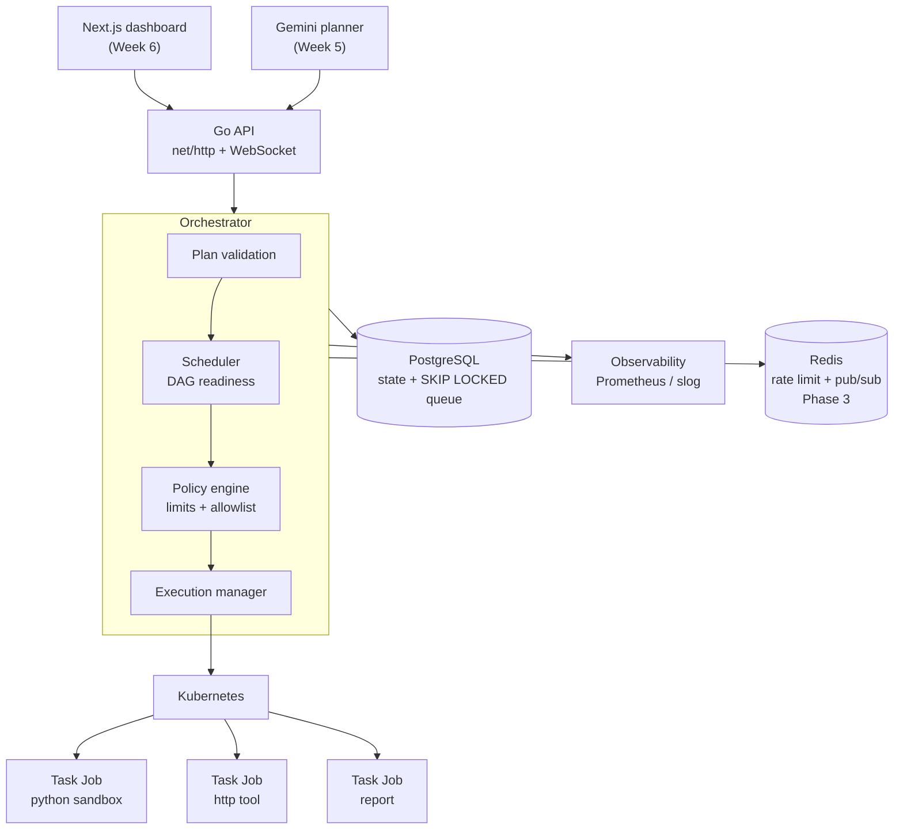
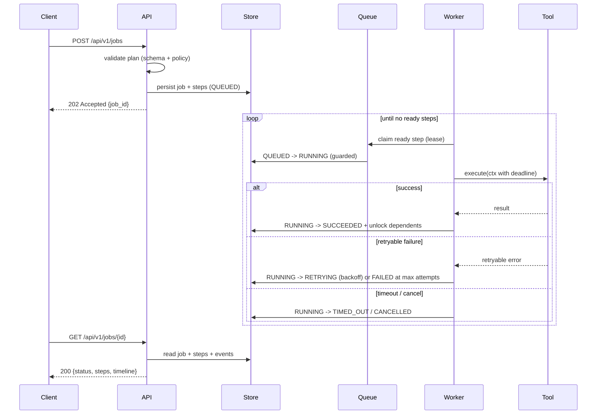
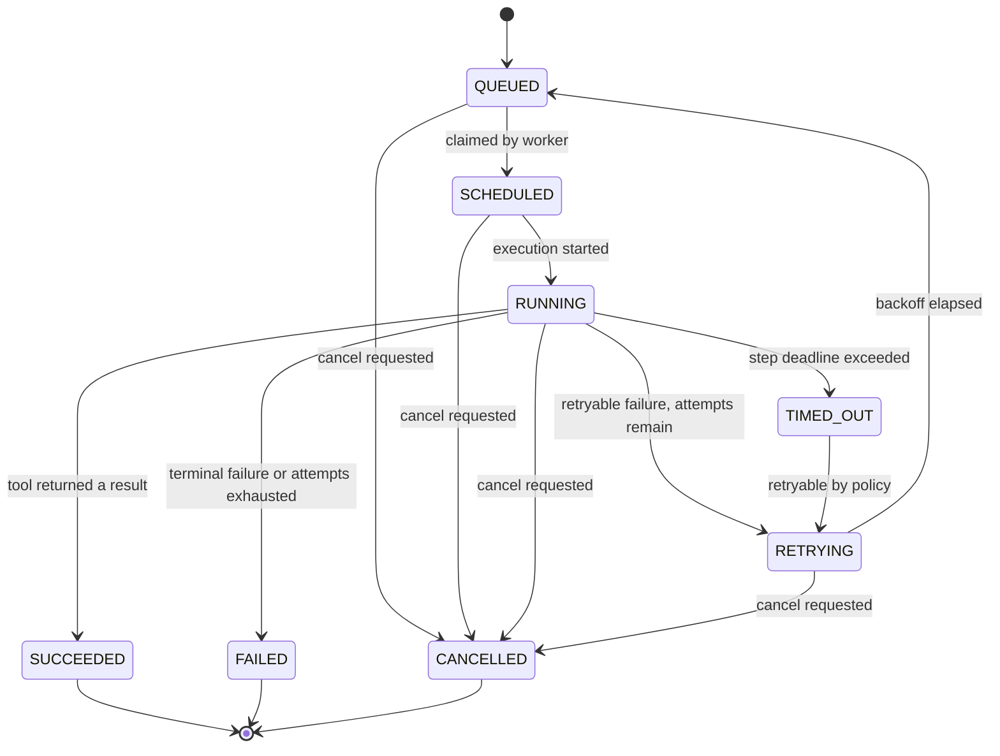

# RunMesh architecture

> An LLM decides **what** should be done. RunMesh decides **how** it is executed —
> safely, reliably, concurrently and observably.

## System view

## Execution lifecycle

## Job state machine

## Where the interesting engineering is

| Concern | Mechanism | Introduced |
|---|---|---|
| Concurrency | Bounded worker pool, goroutines + channels + `select` | Week 1 |
| Cancellation | `context.Context` propagated API → scheduler → worker → tool | Week 1 |
| Timeouts | Per-step deadline derived from the tool contract | Week 1 |
| Dependencies | Step DAG; a step becomes ready when all `depends_on` succeed | Week 1 |
| Failure policy | Error taxonomy → retryable vs terminal; exponential backoff | Week 1 |
| Durability | PostgreSQL store; queue via `SELECT … FOR UPDATE SKIP LOCKED` | Week 2 |
| Crash recovery | Leases + heartbeats + a reconciler loop over expired leases | Week 2 |
| Isolation | Kubernetes Jobs: non-root, resource limits, NetworkPolicy | Week 3–4 |
| Planning | Gemini structured output → schema validation → policy validation | Week 5 |
| Observability | Event timeline, Prometheus metrics, execution waterfall UI | Week 6 |

## Design records

Decisions with real alternatives are recorded in [`docs/decisions`](../decisions):

- [0001 — Execution is at-least-once](../decisions/0001-execution-is-at-least-once.md)
- [0002 — PostgreSQL is the queue; Redis is deferred](../decisions/0002-postgresql-is-the-queue.md)
- [0003 — Execute tasks as Kubernetes Jobs, not raw Pods](../decisions/0003-kubernetes-jobs-not-pods.md)
- [0004 — Standard-library `net/http`, zero third-party dependencies](../decisions/0004-standard-library-http.md)
